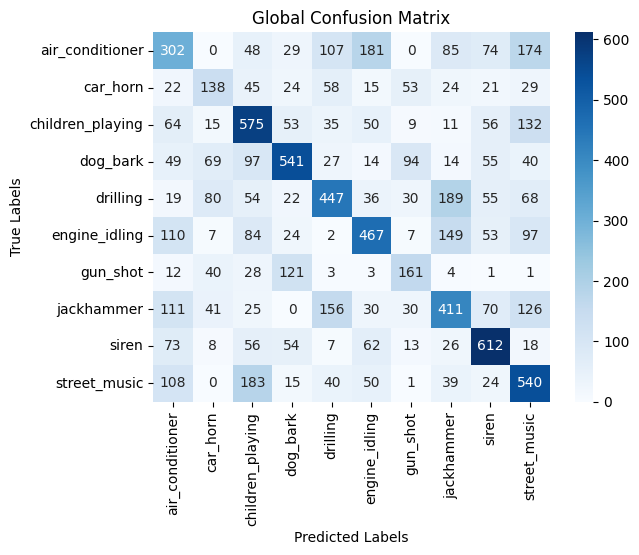
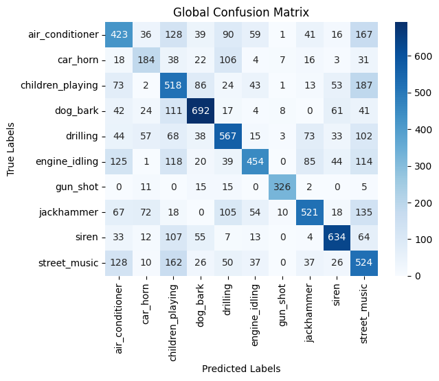
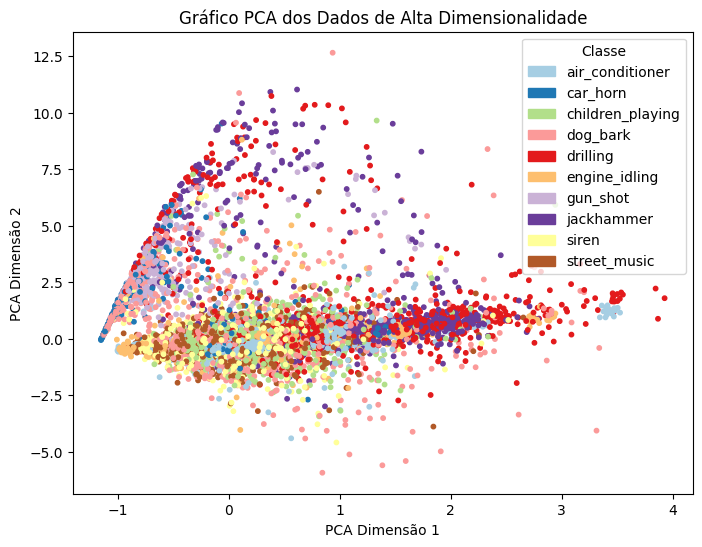
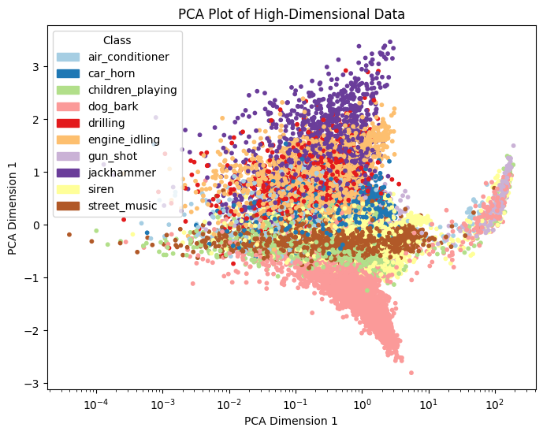
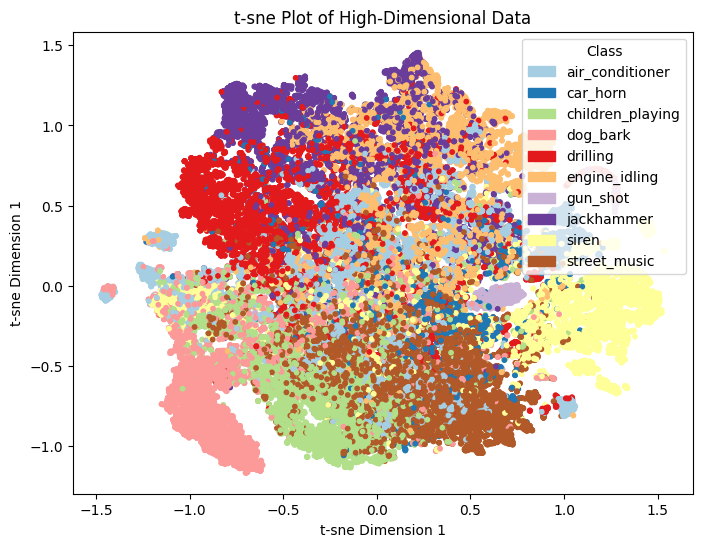
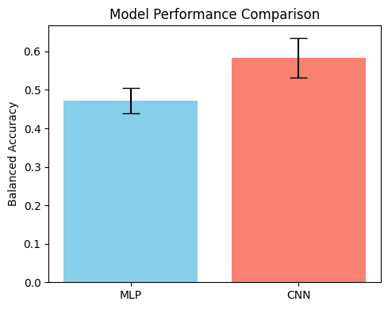

# ML2 | Classificação de Sons Urbanos

    

    
    
    

 

    
    
    
    

## Visão geral do projeto

A `classificação de sons` é considerada uma das tarefas mais importantes no campo do **aprendizado profundo**. Ela tem grande impacto nas aplicações de **reconhecimento de voz** em assistentes virtuais (como Siri ou Alexa), **atendimento ao cliente**, bem como em **sistemas de recomendação de conteúdo musical e de mídia**. Além disso, ela também tem impacto na área médica, seja para detectar anormalidades nos batimentos cardíacos ou nos sons respiratórios. Além disso, também é utilizada em **sistemas de segurança e vigilância** para ajudar a detetar e avaliar uma possível violação de segurança dentro de uma casa, seja por chamadas de socorro ou mesmo tiros e vidros a partir. Portanto, o nosso objetivo é desenvolver **algoritmos de aprendizagem profunda** que nos permitam classificar adequadamente alguns sons ambientais fornecidos pelo `Conjunto de dados UrbanSound8k`.

## Desenvolvimento do projeto

### Dependências e execução

Este projeto foi desenvolvido utilizando um `Notebook`. Portanto, se quiser testá-lo, lembre-se de utilizar uma **[Distribuição Anaconda](https://www.anaconda.com/)** ou um software de terceiros que o ajude a inspecionar e executá-lo.

Portanto, para obter mais informações sobre o **Ambiente Virtual** usado no Anaconda, considere verificar o [DEPENDENCIES.md](https://github.com/NightF0x26/ML2-Project/blob/main/DEPENDENCIES.md) file.

### Trabalho planeado

O projeto inclui várias fases principais, incluindo:

1. `Análise exploratória de dados` : Começamos por **examinar o conjunto de dados UrbanSound8k** para obter uma compreensão mais profunda da sua **estrutura e conteúdo**, o que nos ajuda a compreender a distribuição das classes de som.
2. `Pré-processamento de dados` : **Limpeza e preparação das amostras de áudio** para garantir a sua consistência e qualidade ao longo do .
3. `Engenharia de características` : Utilizando a biblioteca **Librosa**, extraímos **características significativas** dos dados de áudio, tais como **coeficientes cepstrais de frequência Mel (MFCCs)**.
4. `Definição da arquitetura do modelo` : Desenvolvemos a **arquitetura de redes neurais artificiais** adaptadas à classificação de sons, o que envolve **experimentar diferentes modelos de aprendizagem profunda**.
5. `Treino e avaliação de desempenho` : Empregando o conjunto de dados pré-particionado, realizamos **validação cruzada de 10 vezes** em cada rede desenvolvida para, em seguida, avaliar o desempenho dos modelos usando métricas-chave, como precisão e matrizes de confusão.
6. `Inferência estatística` : Realizar uma **avaliação estatística** do desempenho entre todas as redes desenvolvidas.

## Conjunto de dados UrbanSound8K

O conjunto de dados `UrbanSound8k` contém **8732 trechos de som rotulados** ($\le$ 4s) de sons urbanos de **10 classes**: air_conditioner, car_horn, children_playing, dog_bark, drilling, enginge_idling, gun_shot, jackhammer, siren e street_music. As classes são extraídas da **taxonomia de sons urbanos**.

Para uma **descrição detalhada** do conjunto de dados, consulte a página web do conjunto de dados disponível [aqui](https://urbansounddataset.weebly.com/urbansound8k.html). Caso esteja interessado no **processo de compilação**, os criadores do conjunto de dados publicaram um artigo descrevendo a Taxonomia para Pesquisa de Sons Urbanos. Pode acessá-lo [aqui](https://www.justinsalamon.com/uploads/4/3/9/4/4394963/salamon_urbansound_acmmm14.pdf).

### Conjuntos de dados adicionais

Se estiver interessado em experimentar este projeto, precisa de acesso aos ``datasets completos`` que criámos. Como o GitHub tem **limites de tamanho de ficheiro**, disponibilizamos todos  [aqui](https://drive.google.com/drive/folders/13LYorB-vWtQVRRSUJi1nwCNquWJY-Ubi?usp=drive_link).

## Resultados

### Performance dos Modelos

<!-- Network Architectures - Performances -->

<table width="10%">
    <thead>
        <th>
            

                Arquitectura de Rede
            

        </th>
        <th>
            

                Matriz de Confusão Global
            

        </th>
    </thead>
    <tbody>
        <tr>
            <td>
                

                    MLP
                

            </td>
            <td>
                

                    
                

            </td>
        </tr>
        <tr>
            <td>
                

                    CNN
                

            </td>
            <td>
                

                    
                

            </td>
        </tr>
    </tbody>
</table>

- **MLP**: Atingiu **45-50%** de exatidão, mostrando dificuldade com a complexidade dos dados sonoros.
- **CNN**: Teve melhor desempenho, com **55-60%** de exatidão, beneficiando-se das representações tempo-frequência (MFCCs).

### Visualisação da Redução de Dimensionalidade

<!-- Data Distribution Scatter Plots -->

<table width="100%">
    <thead align="center">
        <th colspan="3">
            
Data Distribution Scatter Plots

        </th>
    </thead>
    <tbody>
        <tr>
            <td></td>
            <td>
                

                    1-Dimensional Processed MFCC's
                

            </td>
            <td>
                

                    2-Dimensional Raw MFCC's
                

            </td>
        </tr>
        <tr>
            <td width="10%">
                

                    PCA
                

            </td>
            <td width="45%">
                

                    
                

            </td>
            <td width="45%">
                

                    
                

            </td>
        </tr>
        <tr>
            <td width="10%">
                

                    t-SNE
                

            </td>
            <td width="45%">
                

                    
                

            </td>
            <td width="45%">
                

                    
                

            </td>
        </tr>
    </tbody>
</table>

### Diagram de Comparação de Desempenho

<!-- Model Performance Comparison Diagram -->

    <table width="30%" height="30%">
        <tbody>
            <tr>
                <td>
                    

                        
                    

                </td>
            </tr>
        </tbody>
    </table>

Este gráfico mostra a média das exatidões de cada modelo:

1. **CNN** é o melhor dos 2 modelos, tendo uma média de exatidão de ~0.58.
2. **MLP** produz piores resultados, tendo uma média de ~0.47.

## Conclusão

As nossas experiências mostraram que o **CNN** foi o mais eficaz. Técnicas de regulação como **Dropout** e **L2** aujudaram a diminuir o overfitting. Apesar do bom desempenho geral, distinguir classes acústicamente similares ainda é um desafio e melhorias em extração de cracterísticas e desenho de modelos podem aumentar a exatidão.

## Authorship

- **Authors** &#8594; [Nuno Gomes](https://github.com/NightF0x26) and [Zhixu Ni](https://github.com/zni0218)
- **Course** &#8594; Machine Learning II [[CC3043](https://sigarra.up.pt/fcup/en/ucurr_geral.ficha_uc_view?pv_ocorrencia_id=546532)]
- **University** &#8594; Faculty of Sciences, University of Porto

<!--  -->

`README.md by Nuno Gomes`

